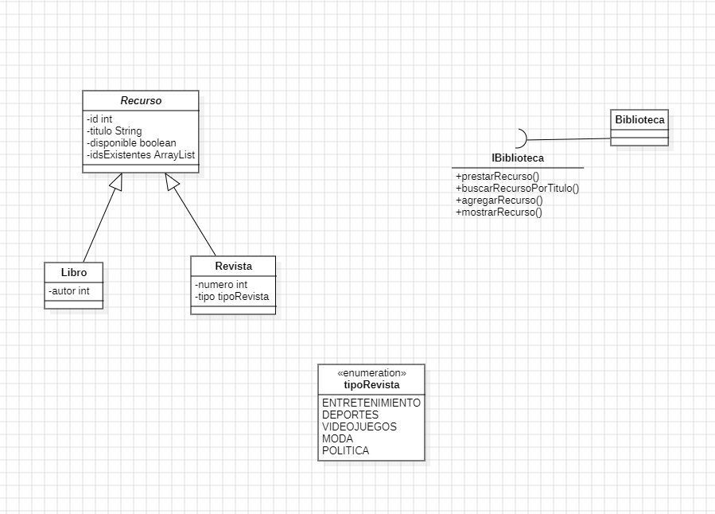

# Este es el reto numero 1, del día 9 de Enero de 2024
## Usando el lenguaje de programacion: Java y usando StarUML.
##### En este reto estamos utilizando los PRINICIOS SOLID y también estamos usando patrones de diseño.
##### Este programa gestiona el almacenamiento de Libros y Revistas de una biblioteca, pudiendolos rentar y añadir más a la biblioteca, también se puede revisar los recursos actuales y buscar especificamente por titulo cada recurso.

### En esta imagen se aprecia el diagrama de clases.

